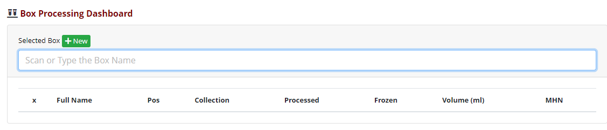
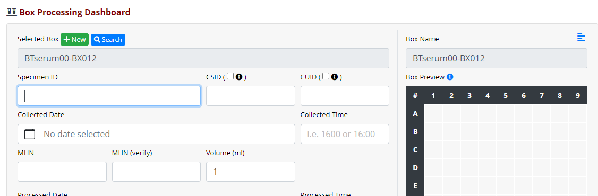
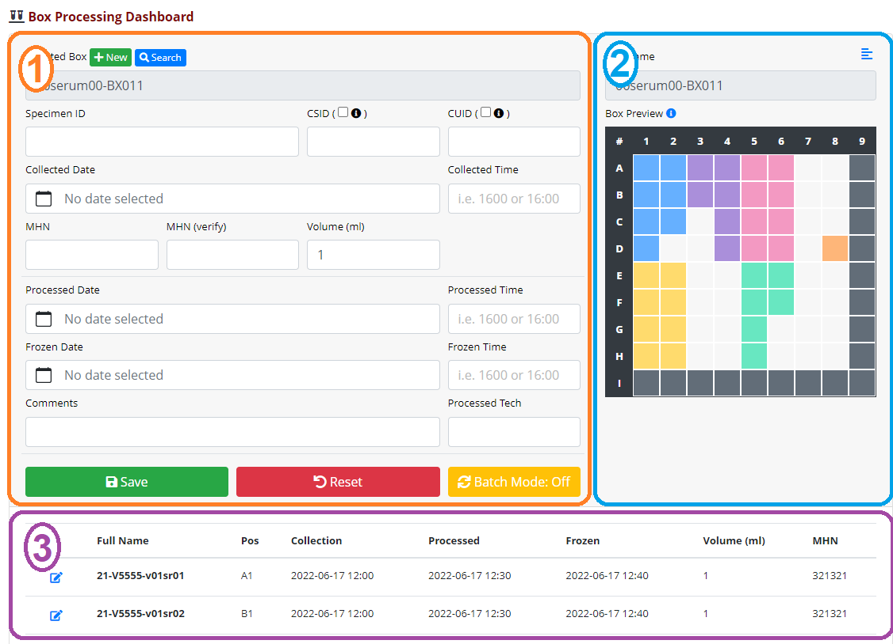
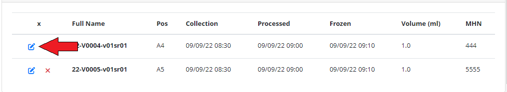
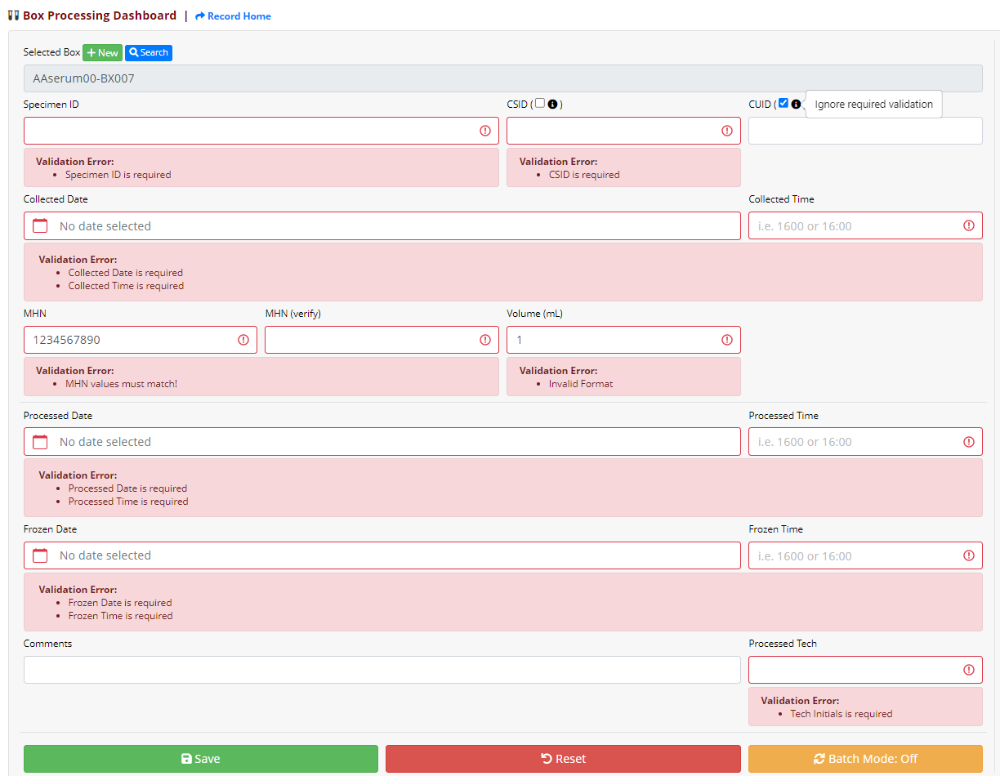
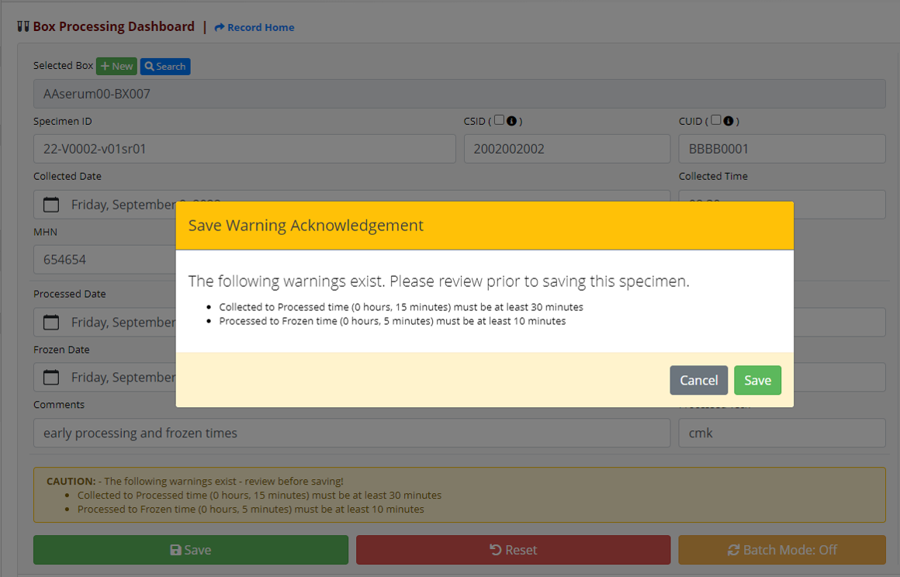
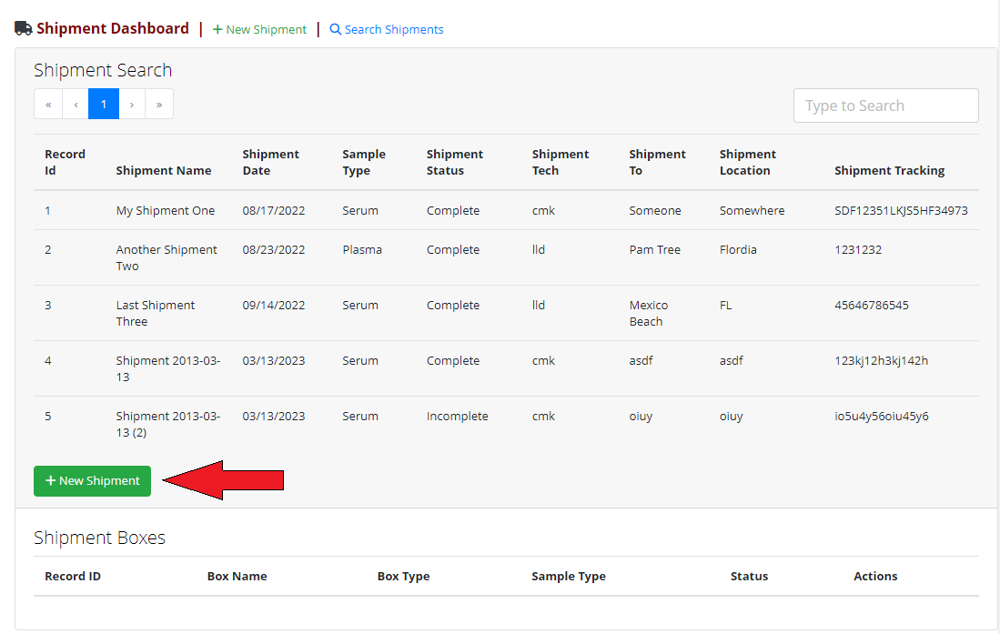
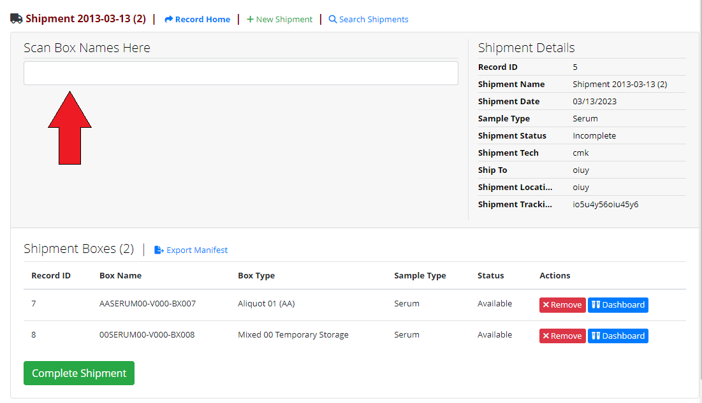
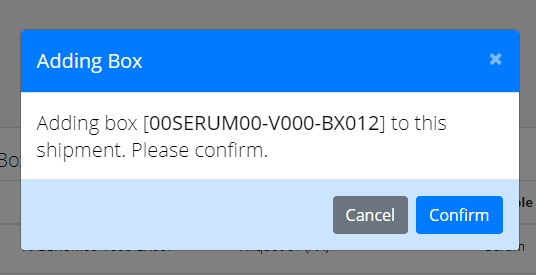
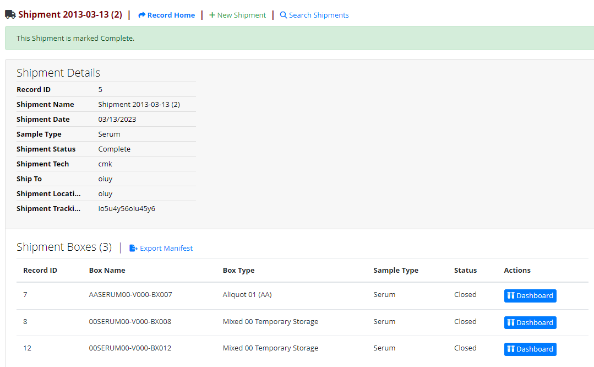

# Orca Specimen Tracking (REDCap External Module)

An easy-to-use custom interface for receiving, boxing, and shipping specimens.

---

## Features

- Control Center-level configuration to support a variety of project setups
    - Multiple project configurations can be created
- Comprehensive box & specimen validation
- A specimen receipt interface that includes:
    - Streamlined data entry
    - Detailed list of specimens
    - Box preview for quick at-a-glance look at specimens in the current box.
- Shipment assignment interface
- Shipment manifest exports

---

## Technical Requirements

- REDCap
    - Framework Version: 10
    - Minimum: v12.4.1 STD
    - Tested against: 13.4.0 STD
- PHP
    - Tested against: v7.4.21 and v8.1.11

---

## Permissions

- redcap_every_page_top
    - Used to seamlessly redirect the user back to the custom pages of this module, after creating a new box.
- redcap_data_entry_form
    - Used for copying a calculated box name to the actual box name field, so the Secondary Unique Field feature can be used. 
        - See the `[box_name_calc]` documentation under the optional box fields.        

---

## Developer Notes

This project makes use of VueJS and Laravel Mix to develop and build.

To build, use `npx mix watch`.    See the [laravel docs](https://laravel-mix.com/docs/6.0/cli) for more details.

## Getting Started

- This module works as intended through careful setup of 3 projects (box, specimen, & shipment), with additional required configuration in the Control Center. 
- It is **strongly recommended** to use the Project XML files provided in the release that corresponds to your version of the module.
    - https://github.com/dr01d3r/redcap-em-biospecimen-tracking/releases 

### Box Project Requirements

- General Project Setup
    - Non-longitudinal
    - Non-repeating instrument that contains all required fields.
    - Other fields/instruments can exist, so long as they don't interfere with the previous 2 points.
        - Consider long-term performance when expanding the project - **less is more**!
- Required Fields
    - `[record_id]`
        - The projects record ID field must remain the default value of `[record_id]`.
            - **TODO** this could be updated without too much issue, to not care what its called.
    - `[box_name]`
        - Expected Field Type: **Text**
        - This is the primary field for identifying boxes.
        - Must be unique.
            - Consider utilizing the Secondary Unique Field feature for this.
    - `[box_type]`
        - Required Field Type: **Single Select (dropdown/radio)**
        - A key field for determining the type of box being used.
        - Validation, box orientation, and other features depend on this value.
        - Special Values (reserved)
            - 00, Mixed 00 Temporary Storage
                - Can only be used in a very specific project type due to a significant amount of logic & validation surrounding this box type.
            - **TODO** Shipping|Archive|Destroyed
    - `[sample_type]`
        - Required Field Type: **Single Select (dropdown/radio)**
        - Specimen and volume validation, and volume unit display depend on this value.
        - The value of this field will be expected to match the `[sample_type]` component of the Aliquot nomenclature.
    - `[box_status]`
        - Required Field Type: **Single Select (dropdown/radio)**
        - Required Values
            - ```
                available, Available
                closed, Closed
                ```
        - This is a field used primarily for the shipment process, but also as a means to set a box to a read-only state if you want to prevent further changes.
    - `[shipment_record_id]`
        - Reference field for the shipment this box is assigned to.
        - This is never interacted with directly, and should only ever be modified through standard module usage.
- Optional Fields
    - `[box_name_calc]`
        - The `[box_name]` field in our projects is built based on many other fields on the box form (as seen in our example Box XML).    Due to the field being a `@CALCTEXT`, you cannot set it as a Secondary Unique Field.    So the only way for us to ensure uniqueness is to stage the calculated name in a separate field (`[box_name_calc]`) and then use a **hook** to populate `[box_name]`.
        - Currently, there is no configuration to explicitly turn this functionality on or off - it is always on - however, if your form does not contain **both** `[box_name]` & `[box_name_calc]`, the hook will ignore it and do nothing.

### Aliquot Project Requirements

- General Project Setup
    - Non-longitudinal
    - Non-repeating instrument that contains all required fields.
    - Other fields/instruments can exist, so long as they don't interfere with the previous 2 points.
        - Consider long-term performance when expanding the project - **less is more**!
- Required Fields
    - `[record_id]`
        - The projects record ID field must remain the default value of `record_id`.
    - `[box_record_id]`
        - This is where we store the reference to the box where this aliquot currently resides.
        - This is never interacted with directly, and should only ever be modified through standard module usage.
    - `[name]`
        - This is the primary field for identifying aliquots.
        - Must be unique.
            - Consider utilizing the Secondary Unique Field feature for this.
    - `[csid]` & `[cuid]`
        - CDC identification fields
        - Currently, no way to "opt-in" to these fields, so they always display; however, they can be ignored by clicking the checkbox next to their respective labels.
        - A future version update will include a Control Center configuration to either opt-in to these fields, or simply select those checkboxes by default.
    - `[box_position]`
        - The aliquot's position in the box. 
    - `[mhn]`
        - The patient/participant identifier field 
    - `[volume]`
        - The volume of the aliquot.
        - The displayed units are dependent on the `[sample_type]` of the current box.
    - `[date_time_collected]`
        - Required Field Type: `Datetime (M-D-Y H:M)`
        - Tracks the date & time of specimen collection.
    - `[date_time_processed]`
        - Required Field Type: `Datetime (M-D-Y H:M)`
        - Tracks the date & time the specimen was processed. 
    - `[date_time_frozen]`
        - Required Field Type: `Datetime (M-D-Y H:M)`
        - Tracks the date & time the specimen was frozen. 
    - `[tech_initials]`
        - Free-text field to track who processed the specimen. 
    - `[comment]`
        - A free-text note field for providing comments.
        - Warning acknowledgements are also appended to this field.

### Shipment Project Requirements

- General Project Setup
    - Non-longitudinal
    - Non-repeating instrument that contains all required fields.
    - Any optional fields will display on the shipment interface; however, only defined fields below will be included in the manifest export.
- Required Fields
    - `[record_id]`
        - The projects record ID field must remain the default value of `record_id`.
    - `[shipment_name]`
        - A free-text field to uniquely identify the shipment.
        - Uniqueness is recommended, but not required; otherwise, it will be hard to identify while searching for it.
    - `[shipment_date]`
        - Expected Field Type: **Text**
        - Expected Validation: **Any Date format**
        - Allows the search interface to be sorted chronologically
    - `[sample_type]`
        - Expected Field Type: **Single Select (dropdown/radio)**
        - Must match (or be a subset of) `sample_type` in the box project
    - `[shipment_status]`
        - Required Field Type: **Single Select (dropdown/radio)**
        - Required Values
            - ```
                incomplete, Incomplete
                complete, Complete
                ```
        - The status of the shipment, controlled through the "Complete Shipment" process.
            - A status of 'complete' puts the shipment into a read-only state, as well as sets all assigned boxes to 'closed'. 
- Additional Required Fields
    - These are explicitly defined in the Shipment Manifest Export.
        - As the module evolves, these may be able to be handled in a better way. 
    - `[shipment_to]`
        - Free-text field of who the shipment is going to. 
    - `[shipment_location]`
        - Free-text field of where the shipment is going to. 
    - `[shipment_tracking]`
        - Free-text field for tracking the shipment 

### Control Center Configuration

> **NOTE:** This section can only be completed by REDCap Administrators.

After the projects are created, module configuration can begin within the Control Center.

1. Start by selecting the Box, Aliquot & Shipment Projects.
1. Specify the box dimensions that will be used in this configuration
    - Currently, this module only supports a single box size per configuration.
1. The remaining configuration options should be self-explanatory (HOPEFULLY!)

## Regular Expressions (Box and Aliquot Nomenclature)

For the BOX regular expression, the following is a list of all allowable named capture groups that are currently coded/used within validation.
- `box_type`
- `sample_type`
- `aliquot_number`
- `visit`
- `box_number`

For the ALIQUOT regular expression, the following is a list of all allowable named capture groups that are currently coded/used within validation.
- `year`
- `participant_id`
- `visit`
- `sample_type`
- `aliquot_number`

More on these regular expressions in the Validation section.

---

## Usage

The primary entry point to this module's functionality is the "Box Dashboard" link in the "External Modules" section of the sidebar.

### Creating a Box

You need a Box!?    Click that wonderfully green New button!



It will take you to the data entry page for a box, allowing you to provide all necessary data values and save it.    Be sure the `[box_name]` & `[box_type]` fields have a value as a result of this data entry step.

When the save step is complete, REDCap will try to take you back to the Record Home page for that new box.    Instead, the module will bring you right back to this dashboard, with the new box in context! 



### Scanning an existing Box

If you're coming to the dashboard with a box already in-hand, or you have a specific box you want to search for, simply type or scan the box name into the search field and hit enter.    If it exists, it the interface will update to be in context of that box; otherwise, it will display an appropriate error message.

- Some errors (alerts) will generally indicate the box does not exist.
- You may also see validation errors if what was typed/scanned does not match the box nomenclature.

### Dashboard layout (in Box context)

Before covering more detailed usage, let's review the general layout of the dashboard.



#### Specimen Entry `[1]`

This is where you set your box context, and where most of the data entry occurs.

- Designed to flow from field to field, as you scan or hit the `ENTER` key (`TAB` also works).
- Has a `Batch Mode` that further streamlines data entry.
    - Can pre-fill many fields, depending on the match level of the scanned specimen.

#### Box Preview/Details `[2]`

A summary of specimens within the box.

- Depending on `[box_type]`, specimens may be displayed in more than 1 color. 

#### Specimen List `[3]`            

A list of all specimens currently in the box.

- Shows most (but not all) data tied to a specimen
- Sorted based on `box_type`
- Has the ability to edit a specimen, if necessary
    - A dialog will pop up, containing the same interface in section `[1]`

#### Adding a Specimen to the Box

An attempt was made to make this process more efficient during the scanning/entry process.  When I can reliably know when you've finished a field (i.e. hitting the `enter` or `tab` key), not only does validation trigger, but when validation succeeds, the cursor focus is moved to the next available field.  If Batch Mode is enabled, then this process attempts to skip those fields.

As you work through the fields, from Specimen Name all the way to Tech Initials, you will eventually come across one or more of the many validation checks that are in place.    This validates every piece of data provided, to ensure it meets all our requirements.    These validations include (but not limited to):

- Specimen Entry Validation
    - See the validation section below for specimen-specific validation
- Basic box validation
    - It's not full
        - This concept expands beyond basic empty positions for the 'Temporary' box type.
- The box is a valid destination for the scanned specimen
    - Given all the keywords in the specimen nomenclature (i.e. year, visit, etc.), all values must be exact matches for any matching keyword in the box nomenclature.
        - Example: Specimen `21-V5555-v01[sr][01]` scanned in context of Box `AA[serum][01]-BX011`
            - Let's assume that specimen nomenclature groups indicated by `[]` are `sample_type` (`sr`) and `aliquot_number` (`01`).    The box also contains a `sample_type` (`serum`) and `aliquot_number` (`01`).  **NOTE:** This particular box nomenclature uses a calculated sample type value 'serum'; however the comparison will look directly at the box's `sample_type` field of `sr`.  In this scenario, both are an exact match.
            - Since the specimen contains no other named parts that align with the box nomenclature, this specimen passes this validation step.

### Editing a Specimen

Editing a specimen in a box is as simple as clicking the edit button for that specimen in the list.



It will open up a dialog window the same interface that you use while creating the specimens, with the same validation.  The only difference is that the Specimen ID field cannot be edited.

### Validation

Validation is a major component of this module.  All aspects of module & project configuration are checked regularly, as well as a vast amount of validation during data entry.

#### Configuration Validation

The following rules are checked any time the module takes action, whether you're navigating between module pages or attempting to save data.

- Project Selection
  - All 3 projects (Box/Specimen/Shipment) must be selected
  - Project selection must be unique across all configurations (used only once)
- General Configuration
  - All fields in this section are required and must have a value
- Optional Configurations
  - Not required; however, they must match format requirements
- Mixed '00' Temporary Box Configuration
  - If you opt into this feature using the initial checkbox, the remaining options must have values.

#### Specimen Entry Validation

As seen in the images below, there is a significant amount of validation sitting behind the scenes.  Most fields are required and must match specific data formats.

- Specimen ID
  - Requried
  - Must match the nomenclature defined in the module configuration
  - Must match the `[sample_type]` of the box its being added to
  - Must match other matching components of the box (i.e. a box with visit 1 defined in the name will only allow visit 1 specimens)
- CSID
  - Required (can be manually overridden)
  - 10-digit number
- CUID
  - Required (can be manually overridden)
  - 8-digit alphanumeric
- Collected Date & Time
  - Both fields are Required (they combine into a singular `Datetime (M-D-Y H:M)` field)
  - The Time field is in 24-hr military time (i.e. 0800 or 1600)
  - Cannot be in the future
- Processed Date & Time
  - Both fields are Required (they combine into a singular `Datetime (M-D-Y H:M)` field)
  - The Time field is in 24-hr military time (i.e. 0800 or 1600)
  - Cannot be in the future
  - Cannot be before Collected DateTime
- Frozen Date & Time
  - Both fields are Required (they combine into a singular `Datetime (M-D-Y H:M)` field)
  - The Time field is in 24-hr military time (i.e. 0800 or 1600)
  - Cannot be in the future
  - Cannot be before Processed DateTime
- MHN
  - Free text field; however, a pseudo-field "MHN (verify)" is used for double-entry to ensure accuracy
- Volume
  - Required
  - Number (1 decimal place)
- Processed Tech
  - Required

**Validation examples in Specimen Entry**




Additional validation exists during specimen entry, but instead of generating errors that prevent data entry, they generate warnings.  These warnings can be acknowledged by the user to allow the data to still be saved.  These acknowledgements are appended to the `[comments]` field like a formatted log entry.

- Collected to Processed DateTime
  - Must be **at least** 30 minutes
  - Cannot exceed 18 hours (by default).  This timespan can be overridden in the module configuration.
- Processed to Frozen DateTime
  - Must be **at least** 10 minutes

**Example acknowledgement**

`[2023-03-17 08:46][kadolphc] - Collected to Processed time (23 hours, 0 minutes) cannot exceed 16 hours`

> **NOTE:** Acknowledgements will trigger on every save of the specimen, which will generate additional entries (rows) in the comments field.



### Creating or Searching for a Shipment

When you're ready to create a shipment and assign boxes, you can navigate to the Shipment Dashboard interface.  The image below shows what that dashboard would look like, filled in with a few example shipments.

If you have an existing shipment to use, simply find it in the list and select that row to get in context of that shipment.  To create a new shipment, you click the **New Shipment** button.



It will take you to the standard data entry form in the shipment project, where you can fill in the necessary data and save it.  Once saved, the module will bring you back to this interface, in context of your new shipment!

### Adding Boxes to a Shipment

The process is very similar to specimen entry, but instead of scanning in the name and filling out all the other data, you simply scan in the box name and that's it!



You'll get prompted to confirm the box addition before it gets assigned to this shipment.



Once you've added all the boxes for this shipment, you can go to complete the shipment.

### Completing a Shipment

Completing a shipment does 2 things:

1. Sets the `[shipment_status]` to `complete`.  This ensures the shipment itself can no longer be modified.
1. Sets the `[box_status]` of all boxes assigned to this shipment as `closed`.  This ensures a number of things:
   - The box can no longer be modified.
   - The box can no longer be added or moved to other shipments.
   - Specimens in the box cannot be moved to other boxes.

> **NOTE:** This read-only state for specimens/boxes is only observed in the module's custom interfaces.  If someone were to manually go to the data entry forms, they can still be edited there.

To complete a shipment, simply click the **Complete Shipment** button.  Like everything else, you'll be prompted to confirm the action.


Once confirmed, the dashboard will update.  It will become read-only, so no more box scan field, and the box list will reflex their new closed statuses as well.



### Exporting a Shipment Manifest

This can be done at any time, after the shipment is created.  Simply click the **Export Manifest** link above the box list.

Doing so will generate and download a CSV file directly to your device.  The name will be simply be "manifest" with a timestamp after it.

**Example Name**

`manifest-2023-03-16-163010.csv`

**Example Output**

```
shipment_name,study_name,shipment_date,sample_type,shipment_to,shipment_location,shipment_tracking,box_name,name,csid,cuid,box_position,"Serum (mL)",comment
"Shipment 2013-03-13 (2)",CMK001010,03/13/2023,Serum,"CDC Lab","Marshfield, WI",LKJ345K34587HJ,00SERUM00-V000-BX012,22-V0101-v01sr01,,,A1,1.0,
"Shipment 2013-03-13 (2)",CMK001010,03/13/2023,Serum,"CDC Lab","Marshfield, WI",LKJ345K34587HJ,00SERUM00-V000-BX012,22-V0101-v01sr02,,,B1,1.0,"some comment"
"Shipment 2013-03-13 (2)",CMK001010,03/13/2023,Serum,"CDC Lab","Marshfield, WI",LKJ345K34587HJ,AASERUM00-V000-BX007,22-V0004-v01sr01,4004004004,DDDD0001,A4,1.0,
"Shipment 2013-03-13 (2)",CMK001010,03/13/2023,Serum,"CDC Lab","Marshfield, WI",LKJ345K34587HJ,AASERUM00-V000-BX007,22-V0005-v01sr01,5005005005,EEEE0001,A5,1.0,
```

---

## Support & Feedback

- If you identify any issues, please submit an issue on this GitHub repo or make a post on the forums and tag me (@chris.kadolph) and/or Leila Deering (@leila.deering).