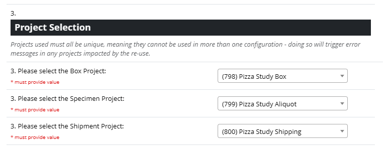
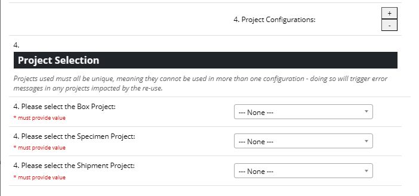
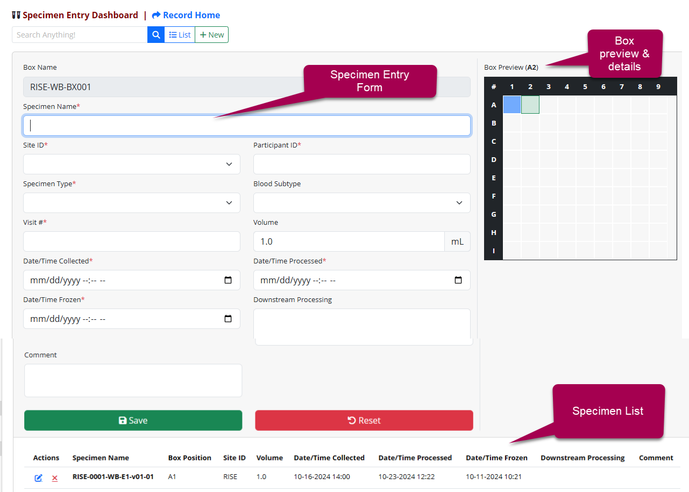

# Orca Specimen Tracking (REDCap External Module)

An easy-to-use custom interface for receiving, boxing, and shipping specimens.

## Migration Guide (v1 to v2)

This is a basic migration guide, to help get you through the initial process of re-configuring an exist set of projects from v1.0.3 to v2.0.0.

### Box Project Changes

**Breaking Change:** New `[box_size]` field required.

This field is required to define the size of the box.

**Solution:** Data Import File

If your project was set up for `8x12` boxes in the Control Center, you can create a simple Data Import file that's just `record` and `box_size`, and for each box record, a value of `8x12`.

**Example:**

```
record_id,box_size
1,8x12
2,8x12
3,8x12
...
999,8x12
```

### Specimen Project Changes

**Breaking Change:** Required field name change from `[name]` to `[specimen_name]`.

This change was necessary for us, but luckily it should be a pretty simple update.

**Solution:** Data Export & Data Import!

1. Create the new `[specimen_name]` field, or simply create a copy of your existing `[name]` field.
1. Create a Data Export that contains just your `[record_id]` and `[name]` fields.
1. Open and modify the export file, renaming the `name` header to `specimen_name` and adding `name` to the end.
   - The goal is to tell REDCap to update the `[specimen_name]` field and blank out the `[name]` field, so you aren't left with orphan data. 
   - It's best to do this step in Excel.  A text editor can get you there, but extra manual work might need to be done. 
1. Import the file through the Data Import tool, ensuring you force blank values to overwrite.
1. Once the data has been verified, you can delete the old `[name]` field.

### Configuration Changes

**Breaking Change:** Everything!

That might sound rough, but the Dashboard Configuration interface hopefully does a good job of making the new configuration process a lot easier, once you get familiar with it.

We had to get the configuration out of the Control Center, and the existing module config was not designed to cover such specific and complex needs, so we build a fully customized interface to replace it.  

- Review the README and the build-in documentation within the configuration interface
- Configure one interface (color-matched columns) at a time and test as you go

## Support & Feedback

- If you identify any issues, please submit an issue on this GitHub repo or make a post on the forums and tag me (@chris.kadolph) and/or Leila Deering (@leila.deering).

## Features

- Comprehensive custom module configuration interface at the Project level
  - Only minimal configuration within the Control Center is necessary
- Specimen Entry Dashboard that includes:
  - Streamlined data entry through multiple pre-fill options
  - Detailed list of specimens in the current box
  - Interactive box preview for a quick at-a-glance look at specimens in the current box.
- Shipment Dashboard for creating and managing box shipments
- Reporting Dashboard for a complete look at the data across all 3 projects
- **All of it is fully-customizable!**

---

## Technical Requirements

- REDCap
  - Framework Version: 14
  - Minimum: v13.7.0
  - Latest: v14.8.0
- PHP
  - Minimum: Module scan tests compatibility v7.3+
  - Latest: v8.2.21

---

## Permissions

- `redcap_every_page_top`
  - Used to seamlessly redirect the user back to the custom pages of this module, after creating a new box.
- `redcap_data_entry_form`
  - Used to bridge the gap between `@CALCTEXT` and Secondary Unique Field in the Box project, this hook will look for a field called `[box_name_calc]` and every time it changes, copy the value into `[box_name]`.

---

## Getting Started

1. Create three projects
  - Your REDCap Administrator will need to do minor configuration for these projects in the Control Center
  - To do so, they must first be added to all 3 projects (a requirement for the project dropdown in the module config)
  - Then have them assign each project to their respective option in the module config



### Box Project Requirements

- `[record_id]`
  - Leave this the default name when creating the project
- `[box_name]` (Text Field)
- `[box_size]`
  - Can be any field type (text, dropdown), but the saved value must use the `9x9` format
  - **Examples**: `7x7`, `9x9`, `8x12`, `44x7`
- `[box_status]` (Dropdown Field)
```
available, Available
closed, Closed
```
- `[shipment_record_id]` (Text Field)

### Specimen Project Requirements

- `[record_id]`
  - Leave this the default name when creating the project
- `[specimen_name]` (Text Field)
- `[box_record_id]` (Text Field)
- `[box_position]` (Text Field)


### Shipment Project Requirements

- `[record_id]`
  - Leave this the default name when creating the project
- `[shipment_name]` Text field
- `[shipment_status]` Dropdown field
```
incomplete, Incomplete 
complete, Complete
```

### Control Center Configuration

> **NOTE:** This section can only be completed by REDCap Administrators.

1. In the Control Center on the left hand toolbar push manage next to the external modules.
  - If you have not already enabled this module you need to download and enable the module from the REDCap Repo.
  - Once the module is enabled select the appropriate projects for the project type.

Push the plus (`+`) button to support additional sets of configurations.



### Project Setup

The module must be enabled in all three projects that were configured in the Control Center.

In the left hand toolbar section **External Modules**, click **Manage**, then enable a module.  Look for **Orca Specimen Tracking 2** and push enable.  If you do not see the module in this list contact your REDCap Administrator.

In addition to the required fields for each project, you may add any additional fields that your study/collection process requires.

#### Usage of built-in functionality

- The order of the fields in the instrument will be the order they show on the dashboards and in the exports
- Fields marked required* will also be required on the Specimen Entry Dashboard

### Project Configuration

Once enabled, in the left hand toolbar under the **External Modules** section, push "**Dashboard Configuration**."

1. Enter the study name.
2. Enter the regular expression for the box name.
3. Enter the regular expression for the specimen name.

Then you can click the toggles on items you want to show on your project.



**Specimen Entry Column**

Toggle the variables you want to be on the specimen entry form.

**Extras Column**

Many additional customizations can be found here.

- **Pre-fill by Nomenclature**
  - Has the ability to configure how to find matching specimens and to pre-fill the Specimen Entry Form fields
  - Example: You have entered all the data for aliquot 1.  If the pre-fill is enabled and you scan in aliquot 2, all the data such as dates, initials, volume etc., will fill in for you without extra data entry.
- **Confirm**
  - Allows you to set up a double-entry confirmation.  This is useful on MRN's, or SUBJECT ID's to help ensure data entry accuracy.
- **Not in the Future**
  - A datetime validation ensuring the date cannot be in the future
- **After Date**
  - A datetime validation that ensures the date must be after another configured date field
  - You can also set time-based validations or warnings.
    - For example, you can require that the processed time be at least 30 minutes after collection time.  If this condition is false, i.e. 25 mins after collection, a warning will appear, and the data entry staff will have to acknowledge.  The warning will then be recorded in the comment field as a protocol deviation. If you leave the "Warning Only" option deselected, then the user cannot proceed until corrected.

**Batch Mode**

Batch mode allows the values you toggle on to persist during data entry, which is particularly useful when processing aliquots that were prepared at the same time.  These values will remain unchanged when moving to the next sample, eliminating the need to re-enter them.

**Specimen  List**

The lower section of the entry interface contains a specimen list.  Toggle on specimen fields you want to display in the list.
Best to keep concise. This is the best spot to take action on specimens.

**Box Preview and Details**

Displays a list of box information in a collapsible section above the Box Preview in the Specimen Entry Dashboard.  Can display useful box fields like storage location.

**Shipment list**

The are the fields to be displayed when searching and displaying shipment information on the Shipment Dashboard

**Shipment box list**

Fields to be displayed when looking at the boxes that are added to the shipment.

**Shipping Manifest**

Toggle on the items you would like to display on your shipping manifest export.

## Usage

Once you have all your configuration set, go to the Specimen Entry Dashboard and add a box.  This will take you to a REDCap data entry form which you enter information about the box, then push save. You will then be taken back to the specimen entry dashboard where you can start to scan specimens into the box.